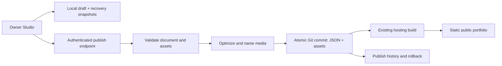

# Portfolio Studio — product and implementation blueprint

## Decision

Replace the current Portfolio Studio direction instead of extending it.

The product should be a **visual project composer for this portfolio**: choose a project, edit the real page directly, drag media into the real layout, rearrange supported sections, preview the exact public result, and publish it.

It should not be:

- a long form that mirrors a JSON object;
- a generic website builder;
- a separate mock preview that only resembles the portfolio;
- an enterprise CMS with a database added before the editing workflow is correct.

The portfolio already has a strong design system and a repeatable case-study structure. Studio should expose those building blocks visually while protecting the design from accidental breakage.

## What the reassessment found

The current implementation is a useful prototype, but it proves the wrong product model.

1. **The preview is not the portfolio.** `StudioPreview` is a separate composition. It does not render `ProjectCard` or `ProjectDetail`, so “looks right in Studio” does not mean “looks right live.”
2. **The editor exposes only part of the content.** It edits title, one-liner, hero image, context, build bullets, skill labels, status, outcome, reflection, gallery, and source link. It cannot edit decisions, tradeoffs, reviews, proof/blocker, stats, features, tech stack, skill descriptions, video, alt text, or project order.
3. **Some editable data has no public output.** `gallery` and `heroVideo` are not rendered by `ProjectDetail`. `decision.tradeoff`, `outcome.proof`, and `outcome.blocker` are stored but not shown. Uploading or editing those fields currently gives a false sense of completion.
4. **Rich layouts are special-cased in code.** Stats, features, and tech stack are only enabled when the project ID is `zero-my-ai` or `glyph`. A newly created project cannot opt into those layouts through content.
5. **Drag-and-drop does not produce publishable media.** Dropped images become base64 data URLs inside IndexedDB. They are large, browser-specific, and cannot become stable public assets.
6. **There is no publish action.** “Export draft” downloads JSON, and the UI refers to publishing even though no publish path exists.
7. **The editor is attached to the public page.** Every visitor sees “Edit projects,” and Studio runs as a full-screen modal over the entire portfolio instead of as an owner workspace.
8. **The mobile workflow is too long.** The tested Studio screen stacks the project library, a large preview, and the entire form into roughly 3,745 pixels of scrolling before completing one project edit.

These are not polish issues. They point to the need for a different editing model.

## North-star workflow

The complete experience should be:

1. Open `/studio` and sign in as the owner.
2. Choose a project from a sortable project library.
3. Switch between **Card** and **Case study** views.
4. Click any visible text to edit it in place.
5. Drop an image onto a media block to replace it.
6. Add, remove, duplicate, hide, or rearrange supported case-study blocks.
7. Switch between desktop and mobile preview widths.
8. Open **Review changes** to see validation issues and a draft-versus-live summary.
9. Publish once. Studio optimizes media, writes the content and assets, triggers the site deployment, and reports when it is live.
10. Restore a previous publish from history if necessary.

If any step still requires editing JSON, moving files by hand, running a command, or asking an agent, the core job is not done.

## Product boundaries

### Studio owns

- projects shown in Selected Work;
- project order, visibility, status, theme, title, summary, and skills;
- case-study sections and their order;
- project images, captions, alt text, and crop focus;
- draft, preview, validation, publishing, and rollback.

### Studio does not own in the first release

- the homepage hero;
- work-history timeline entries;
- writings;
- global typography, spacing, colors, navigation, or animation;
- arbitrary HTML, CSS, JavaScript, or free-form page layouts;
- multi-user editorial workflows.

This boundary keeps the tool safe and finishable. A portfolio editor does not need to become Webflow.

## The editing model

Studio should use a **block document** rendered by the same components as the public portfolio.

A project has two layers:

- **Card identity**: title, short title, one-liner, cover media, status, theme, skills, visibility, and position in Selected Work.
- **Case-study document**: an ordered list of supported blocks.

The card identity is intentionally separate because the card is a compact promotional surface, while the case study is a narrative. Changing the case-study structure should not accidentally change how the grid card reads.

### Initial block library

| Block | Purpose | Editable content |
| --- | --- | --- |
| Hero | Required first section | Title, one-liner, status, hero image/video, source link |
| Metrics | Evidence strip | Value, label, explanation |
| Narrative | Project context | Heading and one or more paragraphs |
| Numbered list | What was built | Heading and reorderable items |
| Media | A single visual moment | Image/video, alt text, caption, fit, focal point |
| Gallery | Multiple visuals | Reorderable media, captions, layout preset |
| Features | Feature walkthrough | Title, description, media, tags |
| Decisions | Design/technical calls | Decision, rationale, tradeoff |
| Review | What worked/challenges | Two reorderable lists |
| Tech stack | Implementation details | Named groups and items |
| Outcome | Result and evidence | Status, narrative, proof link, blocker |
| Reflection | Closing takeaway | Quote-style text |
| Links | External evidence | Label and URL pairs |

Each block has a stable ID, a type, visibility, and typed content. Blocks can be rearranged, but the renderer controls their visual design. This gives freedom over the story without allowing broken layouts.

### Mapping the current projects

| Current field | New destination |
| --- | --- |
| `hero` | Card identity plus required Hero block |
| `context` | Narrative block |
| `build.bullets` | Numbered list block |
| `decisions` | Decisions block, including both `why` and `tradeoff` |
| `review` | Review block |
| `outcome` | Outcome block, including `proof` and `blocker` |
| `reflection` | Reflection block |
| `stats` | Metrics block |
| `features` | Features block |
| `techStack` | Tech stack block |
| `gallery` | Gallery block that actually renders publicly |
| `heroVideo` | Hero media choice rather than a dormant property |
| `skills` | Card identity with label and optional explanation |

There should be no project-ID checks in the renderer. Any project can add a supported block.

## Studio interface

Studio should be a dedicated application route, not a modal inside the public portfolio.

```text
┌──────────────────────────────────────────────────────────────────────────┐
│ Portfolio Studio / Glyph        Card · Case study   Desktop · Mobile     │
│ Saved locally        Undo  Redo                Review changes  Publish   │
├────────────────┬───────────────────────────────────────┬─────────────────┤
│ PROJECTS       │ LIVE CANVAS                           │ INSPECTOR       │
│                │                                       │                 │
│ ↕ Glyph        │   The exact public renderer           │ Only settings   │
│ ↕ Zero         │                                       │ for the selected│
│ ↕ FamilySync   │   Click text to edit                  │ block or media  │
│ ↕ McDonald's   │   Drop media in place                 │                 │
│                │   Drag block handles to reorder       │ Alt text        │
│ + New project  │   + Add section between blocks        │ Crop / focus    │
└────────────────┴───────────────────────────────────────┴─────────────────┘
```

### Project library

- Shows card thumbnails, title, draft/live status, and visibility.
- Reorders projects by drag-and-drop and keyboard controls.
- Creates a project from a small set of templates: **Standard case study**, **Visual build**, and **Deep technical project**.
- Supports duplicate, hide/show, archive, and delete with recovery.
- Provides search only if the project count grows enough to need it.

### Live canvas

- Uses the real `ProjectCard` and case-study block renderers.
- Card view shows collapsed and hover/focus states.
- Case-study view shows the complete document, not a summary mockup.
- Text is edited inline with normal selection, paste, and keyboard behavior.
- Empty blocks show useful prompts only while editing.
- Hovering or focusing a block reveals a small toolbar: drag, duplicate, hide, delete, and settings.
- A `+` insertion control appears between blocks.
- Desktop and mobile are preview widths, not separate content versions.

### Inspector

The inspector is contextual and collapsible. It should never repeat the entire project as a form.

- Selecting text exposes only its label, optional character guidance, and link controls.
- Selecting media exposes file replacement, alt text, caption, fit, and focal point.
- Selecting a block exposes its layout preset and visibility.
- Project-level settings live in a separate drawer for slug, status, theme, visibility, and destructive actions.

### Review and publish

Review changes should show:

- which projects changed;
- which blocks were added, removed, hidden, or rearranged;
- which media files were added or removed;
- publish blockers such as missing titles, missing alt text, invalid links, or empty required blocks;
- non-blocking warnings such as overly long card copy or very large media;
- a link to preview the complete draft before publishing.

The primary action should say **Publish changes**, not “Save.” Saving a draft and changing the public website are different actions and should always look different.

## Content contract

The new content shape should be versioned so future changes can migrate safely.

```ts
interface ProjectDocumentV2 {
  schemaVersion: 2;
  id: string;
  slug: string;
  card: {
    title: string;
    shortTitle?: string;
    oneLiner: string;
    cover: AssetRef;
    status: 'shipped' | 'in-progress' | 'concept' | 'archived';
    theme: ProjectTheme;
    skills: Skill[];
  };
  visibility: 'public' | 'hidden';
  blocks: ProjectBlock[];
  updatedAt: string;
}
```

`ProjectBlock` should be a discriminated union. Every block type owns its validation and renderer. Avoid a universal `content: any` object.

Assets should be references, not data URLs:

```ts
interface AssetRef {
  id: string;
  kind: 'image' | 'video';
  src: string;
  width?: number;
  height?: number;
  alt: string;
  caption?: string;
  focalPoint?: { x: number; y: number };
}
```

The project manifest should hold only project order and the active published version. Project documents remain individually addressable so changing one project does not rewrite everything.

## Rendering architecture

The first engineering task is not the editor. It is making the public renderer honest and reusable.

1. Extract the visual body of `ProjectDetail` from its modal behavior into a reusable project document renderer.
2. Create one renderer per block type.
3. Make `ProjectCard` accept the V2 card contract.
4. Make both public pages and Studio import those same renderers.
5. Remove `zero-my-ai` and `glyph` ID checks; rendering must follow the document's blocks.
6. Add a migration from every current project JSON file to V2.
7. Capture visual-regression screenshots before and after migration so the public portfolio does not change accidentally.

Studio may add editing chrome around a renderer, but it must never maintain a second visual implementation.

## Draft and publishing architecture

The portfolio is already a static Vite site whose content lives in Git. Preserve that strength.

The recommended first production architecture is **Git-backed publishing**, not a runtime content database:



Why this fits the project:

- the public site keeps working without a CMS, database, or API at runtime;
- content and code remain portable and reviewable;
- a publish is one atomic, versioned change;
- rollback uses Git history instead of a parallel revision system;
- the current hosting workflow can continue to build the same Vite application.

### Owner access

- `/studio` is absent from public navigation.
- Owner authentication uses GitHub OAuth or a magic-link provider with an exact email/account allowlist.
- A small serverless/edge publish endpoint holds the GitHub App credential. No repository token is exposed to the browser.
- The endpoint may write only approved content and media paths on the configured branch.
- Anonymous visitors can render published content but cannot read drafts or call publishing actions.

The repository does not currently document how production deployment is triggered. Confirming the host and deploy branch is an implementation prerequisite; the publishing adapter should target the real setup rather than assuming Vercel, Netlify, or Cloudflare.

### Drafts

- Keep IndexedDB for fast autosave and offline recovery.
- Store structured documents and temporary asset blobs separately; never embed base64 images in project JSON.
- Keep the last several local recovery snapshots, not only the current state.
- Show explicit states: `Saved locally`, `Unsaved`, `Publishing`, `Live`, and `Publish failed`.
- Warn if a draft was based on an older published commit.
- Cloud draft sync is a later addition only if editing across multiple devices becomes a real need.

### Media

For the initial portfolio scale, optimized images can remain in the repository under stable project paths.

- Accept JPEG, PNG, and WebP images in the first release.
- Correct orientation and strip unnecessary metadata.
- Create a portfolio-sized WebP/AVIF derivative before publish; do not commit a phone's full-resolution original by default.
- Use content hashes in filenames to avoid stale CDN caches.
- Store dimensions, alt text, caption, and focal point in the asset record.
- Reject unsupported files and explain why before upload.
- Treat video as a separate follow-up decision because repository-hosted video has different size and delivery constraints.

If media volume later outgrows Git, `AssetRef.src` allows migration to object storage without changing the block model.

### Publish sequence

1. Freeze the current editor state into a publish candidate.
2. Validate every changed project and asset.
3. Optimize and fingerprint new images.
4. Build the exact JSON and media file changes.
5. Send them to the publishing endpoint with the expected base commit SHA.
6. Create one commit only if the base SHA still matches; otherwise return a conflict.
7. Trigger or observe the existing host's deployment.
8. Report build success and provide the live URL.
9. Keep the local draft until the deployment succeeds.

Rollback creates a new commit that restores selected prior project documents and assets. It should not rewrite Git history.

## State and interaction requirements

- Use a reducer or editor store with explicit operations such as `updateText`, `replaceAsset`, `addBlock`, `moveBlock`, and `removeBlock`.
- Implement undo/redo from those operations rather than cloning the entire application ad hoc.
- Autosave after a short idle period and on page hide.
- Preserve stable block and item IDs while reordering.
- Support keyboard reordering as well as pointer drag-and-drop.
- Prevent leaving with unsaved asset blobs that have not reached recovery storage.
- Never mutate the public project list while Studio is open; preview uses draft state and the public site uses published state.

That last point corrects a current conceptual bug: editing a local draft should not silently change the portfolio visible behind the modal.

## Validation

Use a shared schema at three boundaries: migration/import, Studio editing, and publish.

Publish blockers:

- duplicate project IDs or slugs;
- missing title, one-liner, status, hero media, or required Hero block;
- a public image without useful alt text;
- an invalid or unsafe external URL;
- an empty visible block;
- a missing referenced asset;
- an unsupported file type or file over the configured limit;
- a schema version the publisher cannot migrate;
- a publish based on a stale repository commit.

Warnings:

- card copy that is likely to truncate;
- excessive block count;
- image dimensions too small for the selected layout;
- duplicate media;
- a project with no evidence/source link.

Validation messages must identify the project and block and take the owner directly to the problem.

## Implementation plan

### Phase 1 — Establish one real rendering contract

- Define `ProjectDocumentV2`, `ProjectBlock`, `AssetRef`, and shared validation.
- Extract the reusable project body from `ProjectDetail`.
- Build the block renderer registry.
- Migrate all ten current projects without changing their public appearance.
- Render gallery, tradeoff, proof/blocker, and other content only when corresponding blocks exist.
- Remove project-ID-based rich-section logic.

**Exit condition:** all current cards and case studies render from V2, visual-regression checks pass, and no content field exists without an intentional renderer.

### Phase 2 — Build the visual editor core

- Add a dedicated `/studio` application shell and remove the public edit button.
- Build the project library and project settings drawer.
- Render exact Card and Case study canvases.
- Add inline text editing.
- Add block insertion, duplication, visibility, deletion, and reordering.
- Add desktop/mobile preview widths.
- Add undo/redo and local recovery snapshots.

**Exit condition:** an owner can create or fully revise a project document through the UI, and every change is visible in the exact renderer.

### Phase 3 — Build the media workflow

- Store dropped files as draft blobs separate from JSON.
- Add direct replacement and insertion on the canvas.
- Add alt text, captions, fit, and focal-point controls.
- Add image validation, optimization, fingerprinting, and orphan cleanup.
- Add a small reusable media picker for assets already used by the project.

**Exit condition:** an image can travel from drag-and-drop to a stable, optimized project asset without manual file handling or base64 JSON.

### Phase 4 — Add real publishing

- Confirm the production host, deployment branch, and build trigger.
- Add owner authentication and the path-restricted publish endpoint.
- Add draft-versus-live review and validation.
- Create atomic content/media commits with optimistic concurrency.
- Track deployment state and expose the live URL.
- Add publish history and non-destructive rollback.

**Exit condition:** clicking Publish changes updates the real portfolio and reports deployment success; no command-line or agent step is required.

### Phase 5 — Hardening

- Test crash recovery, offline edits, stale-base conflicts, failed deployments, and retry behavior.
- Complete keyboard and screen-reader coverage for inline editing, block controls, media, and reordering.
- Add mobile Studio editing only after the desktop workflow is solid; mobile preview remains required from Phase 2.
- Add cloud draft sync only if cross-device editing is genuinely needed.
- Add video after choosing its hosting and transcoding path.

**Exit condition:** interrupted or invalid work can be recovered safely, and a failed publish cannot corrupt the live portfolio.

## Test strategy

### Contract tests

- Every current JSON file migrates to V2.
- Every block type validates and renders.
- Every asset reference resolves.
- V2 documents round-trip through load, edit, save, and publish without data loss.

### Editor tests

- Inline edit, add, duplicate, hide, delete, and reorder blocks.
- Reorder projects.
- Undo and redo mixed text, block, and media changes.
- Restore the latest recovery snapshot after reload.
- Navigate from a validation error to the exact field or block.

### Visual tests

- Public and Studio renderers match at desktop and mobile widths.
- Existing projects retain their current design after migration.
- Card collapsed, hover/focus, and truncated-copy states are covered.
- All block types have empty, normal, and long-content fixtures.

### Publishing tests

- Valid publish creates one scoped commit.
- Invalid content creates no commit.
- A stale base commit produces a conflict instead of overwriting newer work.
- Failed deployment preserves the draft and shows retry guidance.
- Rollback produces a new restorative commit and deploys successfully.
- Anonymous users cannot access draft or publish operations.

## Definition of done

Portfolio Studio is complete when Adi can:

- create a project from a template;
- edit every piece of text that appears on its card and case study;
- add and rearrange supported case-study sections;
- drag in images, set their alt text and crop focus, and see them in the real layout;
- reorder or hide projects;
- preview the exact desktop and mobile result;
- publish to the live site with one action;
- understand and recover from validation or deployment failure;
- restore a previous published version;
- do all of this without editing source files or asking an agent to make the content change.

The key engineering rule is simple: **one content contract, one set of renderers, two modes—published and editable.**
